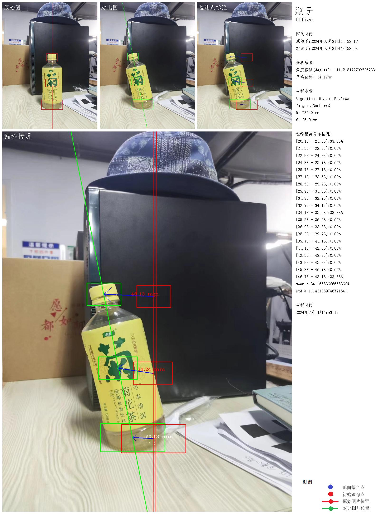

# 将像素距离转化为实际距离

## 大致思路


## 实现代码

```kotlin
/**
     * 将像素距离 xpx 转化成为实际距离 x
     * 函数的具体原理详见 https://imgur.la/image/explain.b8ldS
     * imageW,imageH,D,f的单位都是毫米
     *
     *
     * @Param xpx 照片上的像素距离
     * @param imageW 照片横向的像素数量
     * @param imageH 照片纵向的像素数量
     * @param D 相机到被摄物体的距离（单位：毫米）
     * @param f 相机的等效焦距（即将相机的实际焦距，转化为135相机的焦距）
     *
     *@return 像素距离对应的实际距离
     */
fun pixDistance2ActualDistance(xpx:Double,imageW:Int,imageH:Int,D:Double,f:Double):Double{
        val Wfilm:Int = 36 // 135相机的底片宽度（毫米）
        val Hfilm:Int = 24 // 135相机的底片高度（毫米）

        //计算图像在像素长度(xpx)在底片中的长度（xfilm)
        val xfilm:Double = xpx* kotlin.math.sqrt((Hfilm * Hfilm + Wfilm * Wfilm).toDouble()) / kotlin.math.sqrt((imageW * imageW + imageH * imageH).toDouble())

        // 计算底片长度对应的实际距离
        val x:Double = D * xfilm/f

        return x
    }
```

## 算法测试

### 示例图片 1：


- 显示器的实际尺寸：约 550mm\*280mm
- 摄像头到显示器的距离：约 500mm
- 显示器的像素尺寸：约 1480.28 \* 772.15
- 图片的尺寸：1706 x 1279
- 等效焦距：26mm

计算结果：

```sh
x distance, true=550.0, test = 577.6509652138627
y distance, true=280.0, test = 301.3167730361041
```

虽然和标准距离还是差了一点，但如果只是估算的话，感觉效果还行？

### 示例图片 2


- 牌子的实际尺寸：约 370mm\*280mm
- 摄像头到牌子的距离：约 4000mm
- 牌子的像素尺寸：约 133.00 \* 98.02
- 图片的尺寸：1706 x 1279
- 等效焦距：26mm

计算结果：

```sh
x distance, true=370.0, test = 415.2056550028036
y distance, true=280.0, test = 306.0034458900361
```

上述结果表明，如果只是用来估算的话，这种方法是完全够用的

## 该算法与关键点检测算法的配合效果测试

+ 等效焦距 26mm
+ 摄像头到瓶子的距离：约 280mm

看上去结果还行？
