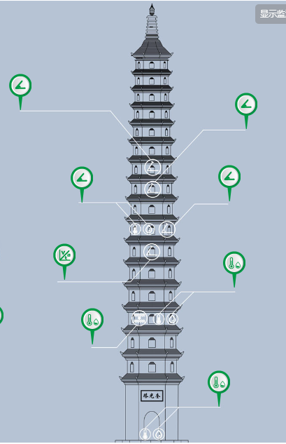

# 基于关键点的图片差异识别（Python）

指定不变的关键点，观测其他关键点的变化，并在图上标注这些变化

## 目前的最新需求

### 前提假设

1. 有一些点的位置是不变的（如塔的基座）——A 类关键点
2. 有一些点的位置是会发生变化的（例如塔每一层的观测点）——B 类关键点

### 需要做的

1. 根据不变的关键点（A 类关键点），纠正因摄像机拍摄角度的变化而导致的图像位置偏差
2. 识别出其他关键点（B 类关键点）的变化
3. 计算出关键点变化的位移、角度等信息

## 如何检测位移

### 需要预先输入的参数

参考点（可以使用上面 A 类关键点）的位置，参考点之间的距离等等。

最简单的情况肯定是四个参考点构成一个矩形，只需要输入矩形的长宽即可。

在这张图上可以标注塔的尺寸：

将真实塔的图片矫正到理想塔的尺寸，即可计算偏移的距离

